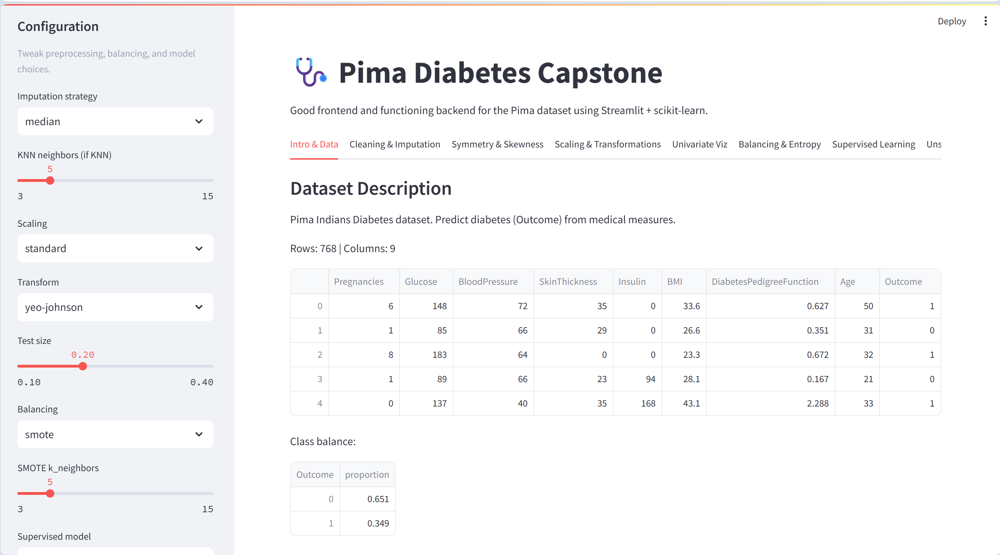
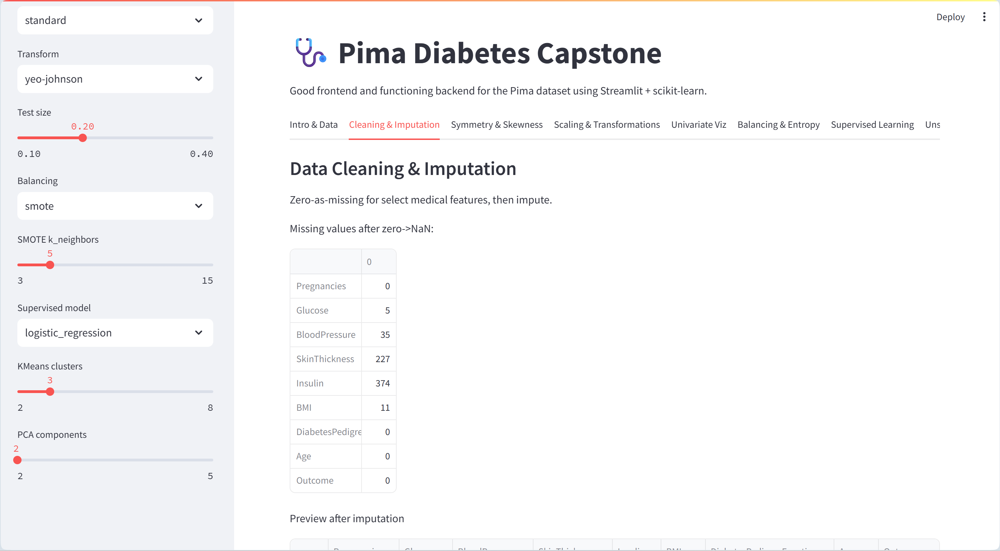
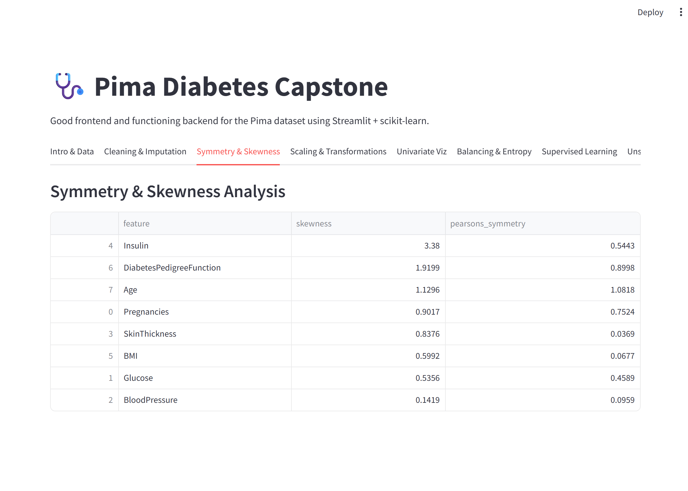
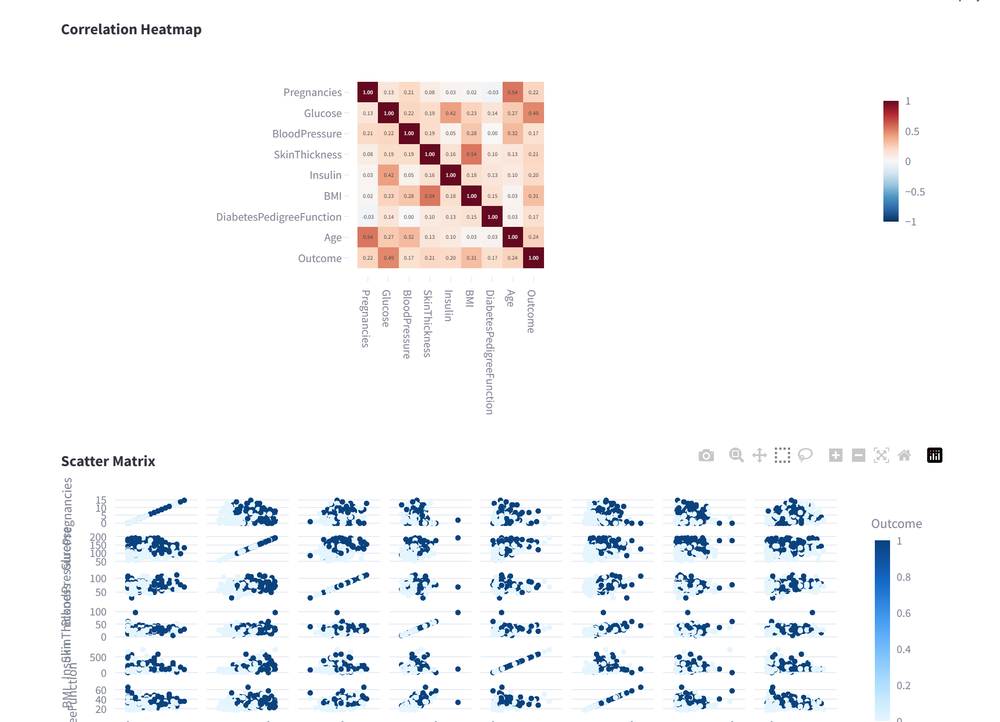
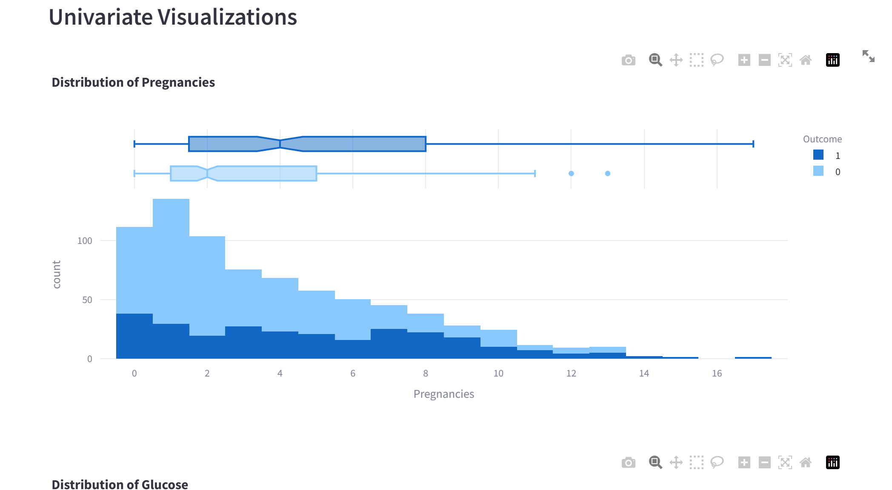
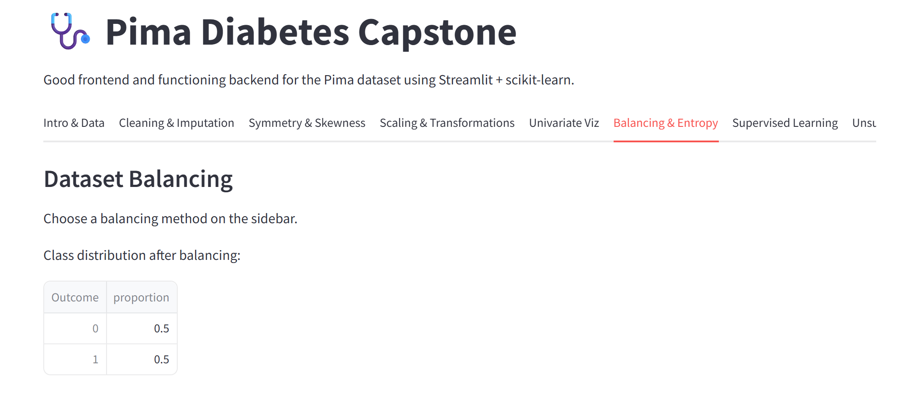
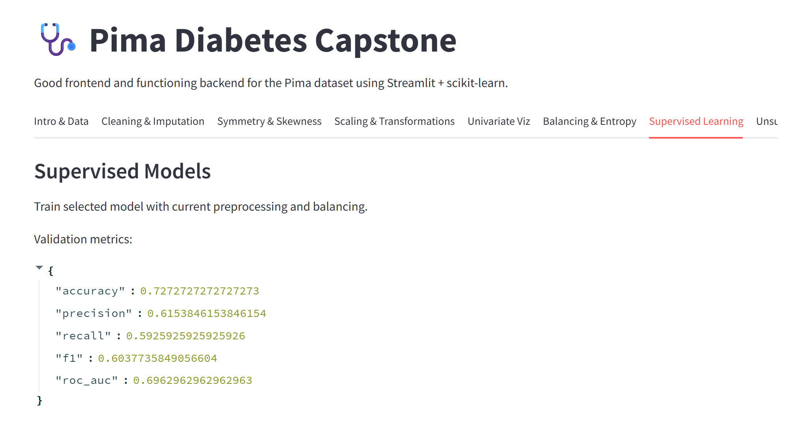
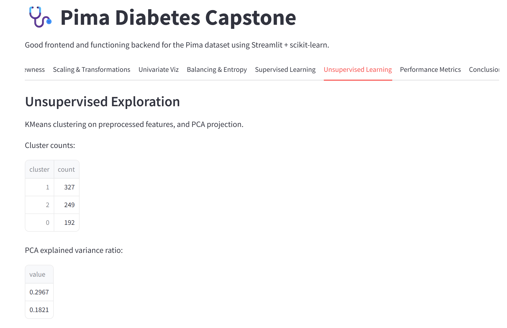
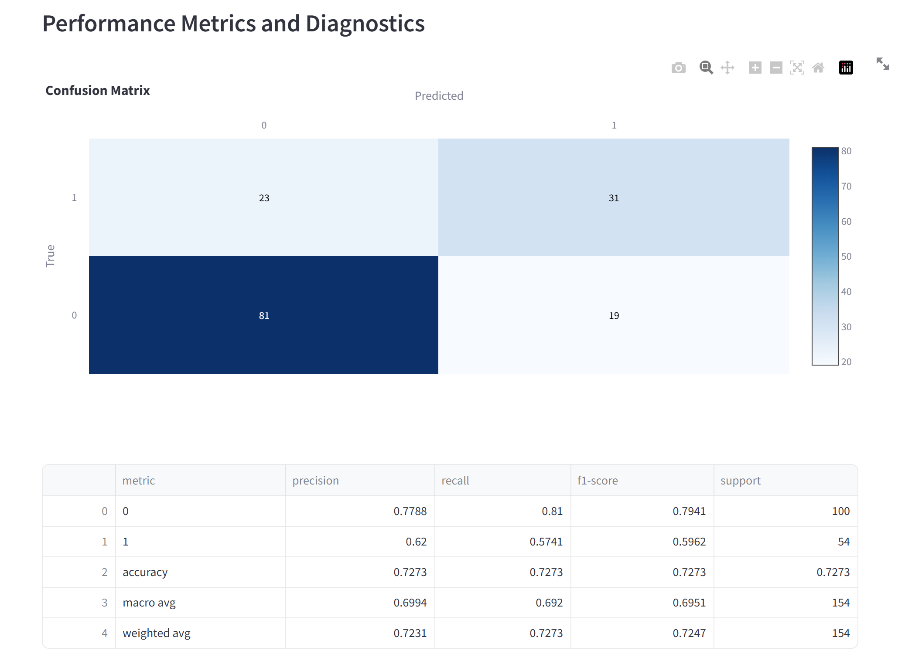

# 🩺 Pima Indians Diabetes – Machine Learning Capstone Project

---

## 📌 Project Overview

This project is a complete **end-to-end Machine Learning capstone** built using the **Pima Indians Diabetes Dataset**.  
It demonstrates the entire data science pipeline including **data cleaning, preprocessing, visualization, dataset balancing, supervised and unsupervised learning, and performance evaluation**, all presented through an **interactive Streamlit web application**.

This project is suitable for **academic submission, viva examination, interviews, and GitHub portfolios**.

---

## 🎯 Objectives

- Handle missing and invalid values using multiple imputation strategies  
- Analyze feature symmetry and skewness  
- Apply feature scaling and transformation techniques  
- Visualize feature distributions and outliers  
- Balance imbalanced datasets  
- Build supervised and unsupervised machine learning models  
- Evaluate models using standard classification and clustering metrics  
- Showcase results using a Streamlit web interface  

---

## 📸 Application Screenshots


<p align="center">
  
</p>

---


<p align="center">
  
</p>

---


<p align="center">
  
</p>

---


<p align="center">
  
</p>

---


<p align="center">
  
</p>

---


<p align="center">
  
</p>


<p align="center">
  
</p>

---


<p align="center">
  
</p>

---


<p align="center">
  
</p>

---

<p align="center">
  
</p>

---


## 🧪 Dataset Description

- **Dataset Name:** Pima Indians Diabetes Dataset  
- **Source:** Kaggle (UCI Machine Learning Repository)  
- **Target Variable:** `Outcome`  
- **Problem Type:** Binary Classification  

---

## ⚙️ Installation & Execution

```bash
git clone https://github.com/Lokaa-v/Pima-Diabetes-Capstone.git
cd Pima-Diabetes-Capstone
python -m venv .venv
.venv\Scripts\activate
pip install -r requirements.txt
